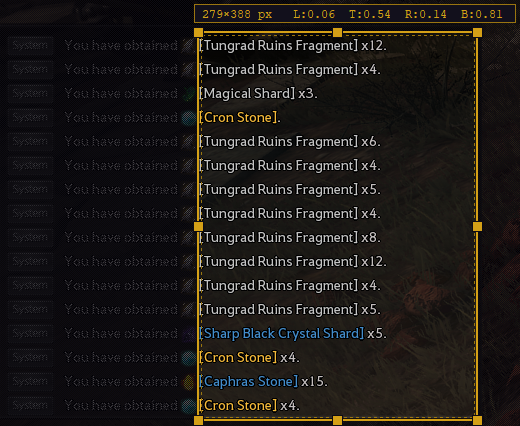

# BDO Loot Tracker

A real-time loot tracking overlay for **Black Desert Online**. It watches your loot pickups via OCR, parses item names and quantities against a known CSV item list.

---

Download the latest version [here](https://github.com/janhnguyen/BDO-Loot-Tracker/releases/tag/v0.1.0-alpha).

### Dependencies

**Tesseract OCR** - [Download here](https://github.com/UB-Mannheim/tesseract/wiki)  
During installation, leave the default options checked (this adds Tesseract to your PATH automatically).

If you skipped that option, add it manually:  
Control Panel → Edit the system environment variables → Advanced → Environment Variables → Edit Path (under User Variables) → New → `C:\Program Files\Tesseract-OCR`

## Features

- **Live loot log**     - timestamped entries appear as items are detected
- **Local storage**     - events are saved to a local database by session
- **Zone detection**    - zones are automatically displayed

## Calibration

Menu → Settings → Calibrate

Set your in-game chat window transparency to 100.
Increase the window size to show atleast 20 items and ensure items fit on one line.

Controls:

    • Click + drag          → draw the capture region
    • Drag edges/corners    → resize
    • Space / Enter         → confirm and run OCR test
    • R                     → reset selection
    • Escape                → quit without saving
    

A debug image is saved to `helpers/calibration_debug.png` for verification.

## Desktop UI (Svelte)

The tracker UI runs as a standalone desktop window (powered by `pywebview`) while still being served locally from `http://127.0.0.1:8765` in the background.
