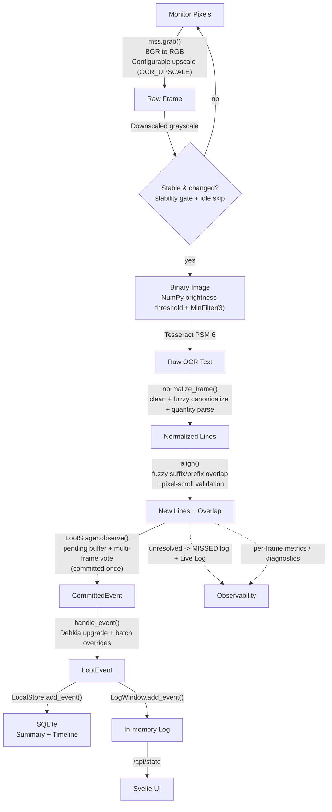

# BDO Loot Tracker

An open-source, real-time loot tracking overlay for **Black Desert Online**. The tracker captures loot notifications using OCR, parses item names and quantities, and stores session statistics locally in SQLite.

---


Download the latest version [here](https://github.com/janhnguyen/BDO-Loot-Tracker/releases).

Questions, comments, or concerns? Get in contact with me through my [discord](https://discord.com/invite/uZYJfGphBP).

## Contents

- [Features](#features)
- [Getting Started](#getting-started)
- [Configuration](#configuration)
- [Development](#development)
- [License](#license)

## Features

- **Live Loot Log** - timestamped items are logged and tracked
- **Local Database** - loot events are saved to SQLite by session with start/end times, duration, and silver per hour
- **Session Analytics** - charts showing silver/items obtained over time, plus a full items breakdown
- **Zone Detection** - grind spots are automatically detected
- **Duplicate-proof tracking** - frame alignment + multi-frame voting prevent double-counting and absorb OCR mistakes
- **Full OCR visibility** - anything the tracker can't read is recorded in Missed logs and shown in the Live Log
- **Open Source** - customize the tracker however you'd like


## Getting Started

### 1. Install Tesseract OCR

[Download Tesseract here](https://github.com/UB-Mannheim/tesseract/wiki).
During installation, leave the default options checked (this adds Tesseract to your PATH automatically).

If you skipped that option, add it manually:
Control Panel → Edit the system environment variables → Advanced → Environment Variables → Edit Path (under User Variables) → New → `C:\Program Files\Tesseract-OCR`

### 2. Download and run

Grab the latest release [here](https://github.com/janhnguyen/BDO-Loot-Tracker/releases) and launch the tracker.

### 3. Calibrate the capture region

Menu → Settings → Calibrate

- Set your in-game chat transparency to 100.
- Increase the window size so it shows at least 20 items and each item fits on one line.

Controls:

    • Click + drag          → draw the capture region
    • Drag edges/corners    → resize
    • Space / Enter         → confirm and run OCR test
    • R                     → reset selection
    • Escape                → quit without saving


> [!TIP]
> A debug image is saved to `helpers/calibration_debug.png` for verification.

### 4. Start tracking

Press **Start** and begin grinding. Stop the session to save it, then open it from
the session list to view its analytics.

## Configuration

Most settings are managed from the in-app **Settings** panel. Advanced options can
be set in a `.env` file next to the executable. See [`helpers/env.example`](helpers/env.example)
for a template.

| Setting | Default | Description |
|---|---|---|
| `CHARACTER_NAME` | `MyCharacter` | Name attached to logged events |
| `DEFAULT_ZONE` | `Unknown` | Zone used until one is detected |
| `TRACKING_WINDOW_SIZE` | `20` | Visible loot lines tracked per frame |
| `SESSION_RESET_DELAY_SECONDS` | `1.5` | Settle delay after Start/Resume before counting |
| `OCR_UPSCALE` | `2.0` | Upscale factor before OCR (lower = faster, may reduce accuracy) |
| `LOOT_MIN_SIGHTINGS` | `3` | Frames a line must persist before it is logged |
| `NAME_FUZZY_THRESHOLD` | `0.82` | Similarity required to match an OCR name to a known item |
| `ENABLE_STABILITY_GATE` | `true` | Skip OCR while the region is animating |
| `ENABLE_SCROLL_HINT` | `true` | Use pixel-scroll detection to disambiguate alignment |
| `MAX_PLAUSIBLE_NEW` | `10` | Max new lines per frame before a jump is treated as misalignment |
| `METRICS_LOG_INTERVAL_SECONDS` | `30` | How often a `[METRICS]` summary is logged |
| `SHOW_LIVE_LOG` | `false` | Show the Live Log pane |
| `SHOW_SYSTEM_MESSAGES` | `true` | Show `[SYSTEM]`/`[ALIGN]`/`[METRICS]` lines in the Live Log |
| `ITEMS_FONT_SIZE` | `12` | Font size of the items list |
| `KEYBIND_START` / `KEYBIND_PAUSE` / `KEYBIND_STOP` | `Control+Shift+A` / `S` / `D` | Global hotkeys |

## Development

### Build from source

```bash
git clone https://github.com/janhnguyen/BDO-Loot-Tracker
cd BDO-Loot-Tracker
pip install -r requirements.txt           # Python deps (also install the Tesseract binary)
cd ui && npm install && npm run build     # build the Svelte UI into ui/dist
cd .. && python main.py                   # run
```

### Run tests

```bash
python -m unittest discover -s tests
```

### Backend

| Tool | Purpose |
|---|---|
| `pytesseract` + Tesseract Binary | OCR engine |
| `mss` | Screen capturing |
| `Pillow` | Image preprocessing |
| `NumPy` | Vectorized image preprocessing, scroll & stability detection |
| `PySide6 (Qt)` | Desktop application window |
| `python-dotenv` | `.env` configuration loading |
| `requests` | HTTP requests (market prices, update checks) |
| `sqlite3` | Local session storage |

### Frontend

| Tool | Purpose |
|---|---|
| `Svelte` | UI framework |
| `Vite` | Frontend build tool |

### Data Flow Pipeline

```mermaid
flowchart TD
A["Monitor Pixels"]
A -->|"mss.grab()<br/>BGR to RGB<br/>Configurable upscale (OCR_UPSCALE)"| B["Raw Frame"]
B -->|"Downscaled grayscale"| S{"Stable & changed?<br/>stability gate + idle skip"}
S -->|"no"| A
S -->|"yes"| C["Binary Image<br/>NumPy brightness threshold + MinFilter(3)"]
C -->|"Tesseract PSM 6"| D["Raw OCR Text"]
D -->|"normalize_frame()<br/>clean + fuzzy canonicalize + quantity parse"| E["Normalized Lines"]
E -->|"align()<br/>fuzzy suffix/prefix overlap<br/>+ pixel-scroll validation"| F["New Lines + Overlap"]
F -->|"LootStager.observe()<br/>pending buffer + multi-frame vote<br/>(committed once)"| G["CommittedEvent"]
G -->|"handle_event()<br/>Dehkia upgrade + batch overrides"| H["LootEvent"]
H -->|"LocalStore.add_event()"| I["SQLite<br/>Summary + Timeline"]
H -->|"LogWindow.add_event()"| J["In-memory Log"]
J -->|"/api/state"| K["Svelte UI"]
F -.->|"unresolved -> MISSED log + Live Log"| L["Observability"]
F -.->|"per-frame metrics / diagnostics"| L
```

### Database

#### Schema
| Table | Purpose |
| --- | ---|
| `sessions` | One row per grinding session: start/end timestamps, duration (HH:MM:SS), average silver per hour, zone |
| `loot_events_local` | Aggregated totals per item per session (quantity sums, has a unique constraint on `(session_id, item_name)`) |
| `loot_events_timeline` | Full granular log: every single drop with `elapsed_seconds` from session start |

#### Key Operations

- `add_event()`: UPSERT - if the item already exists in the session, `quantity` is incremented; otherwise a new row is inserted. Both summary and timeline tables are written simultaneously.
- `end_session()`: computes `avg_hour = total_silver × 3600 / duration_seconds` and writes it back to the session row.
- `get_db_stats()`: aggregate query - all-time silver, top 10 items by quantity, best zones by average silver per hour.

### Desktop UI

The tracker UI runs as a standalone desktop window (powered by `PySide6`) while still being served locally from `http://127.0.0.1:8765` in the background.

## License

Released under the [MIT License](LICENSE).