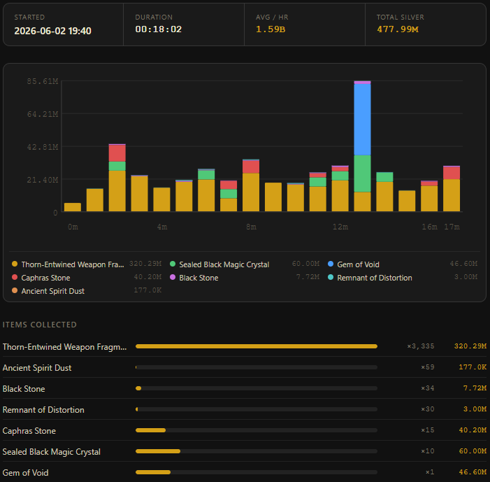
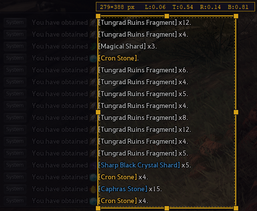
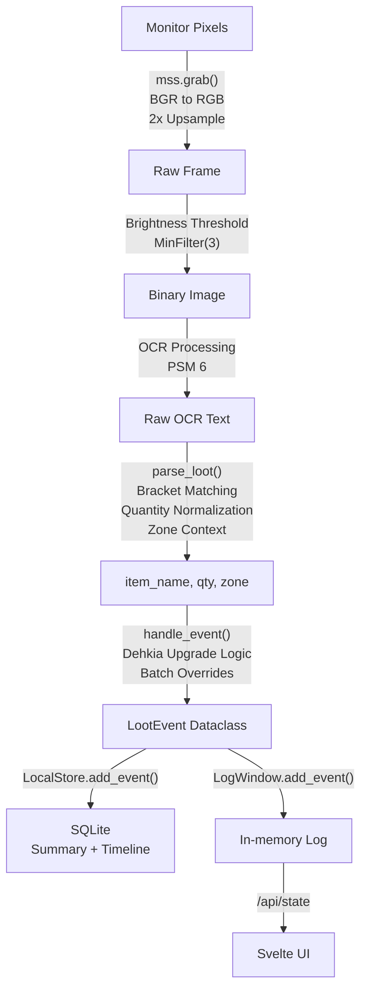

# BDO Loot Tracker

An open-source, real-time loot tracking overlay for **Black Desert Online**. The tracker captures loot notifications using OCR, parses item names and quantities, and stores session statistics locally in SQLite.

---

Download the latest version [here](https://github.com/janhnguyen/BDO-Loot-Tracker/releases).

Questions, comments, or concerns? Get in contact with me through my [discord](https://discord.com/invite/uZYJfGphBP).

## Features

- **Live Loot Log** - timestamped items are logged and tracked
- **Local Database** - loot events are saved to SQLite by session with start/end times, duration, and silver per hour
- **Session Analytics** - charts showing silver/items obtained over time, plus a full items breakdown

- **Zone Detection** - Grind spots are automatically detected
- **Open Source** - Customize the tracker however you'd like

### Dependencies

**Tesseract OCR** - [Download here](https://github.com/UB-Mannheim/tesseract/wiki)  
During installation, leave the default options checked (this adds Tesseract to your PATH automatically).

If you skipped that option, add it manually:  
Control Panel → Edit the system environment variables → Advanced → Environment Variables → Edit Path (under User Variables) → New → `C:\Program Files\Tesseract-OCR`

## Calibration

Menu → Settings → Calibrate

Set your in-game chat window transparency to 100.
Increase the window size to show at least 20 items and ensure items fit on one line.

Controls:

    • Click + drag          → draw the capture region
    • Drag edges/corners    → resize
    • Space / Enter         → confirm and run OCR test
    • R                     → reset selection
    • Escape                → quit without saving
    

> [!TIP]
> A debug image is saved to `helpers/calibration_debug.png` for verification.

## Contributing

If you need help getting started, feel free to message me on Discord.

### Backend

| Tool | Purpose |
|---|---|
| `pytesseract` + Tesseract Binary | OCR engine |
| `mss` | Screen capturing |
| `Pillow` | Image preprocessing |
| `PySide6 (Qt)` | Desktop application window |
| `pystray` | System tray integration |
| `python-dotenv` | `.env` configuration loading |
| `requests` | HTTP requests (market prices, update checks) |
| `sqlite3` | Local session storage |

### Frontend

| Tool | Purpose |
|---|---|
| `Svelte` | UI framework |
| `Vite` | Frontend build tool |

## Data Flow Pipeline

```mermaid
flowchart TD 
A["Monitor Pixels"] 
A -->|"mss.grab()<br/>BGR to RGB<br/>2x Upsample"| B["Raw Frame"] 
B -->|"Brightness Threshold<br/>MinFilter(3)"| C["Binary Image"] 
C -->|"OCR Processing<br/>PSM 6"| D["Raw OCR Text"] 
D -->|"parse_loot()<br/>Bracket Matching<br/>Quantity Normalization<br/>Zone Context"| E["item_name, qty, zone"] 
E -->|"handle_event()<br/>Dehkia Upgrade Logic<br/>Batch Overrides"| F["LootEvent Dataclass"] 
F -->|"LocalStore.add_event()"| G["SQLite<br/>Summary + Timeline"] 
F -->|"LogWindow.add_event()"| H["In-memory Log"] 
H -->|"/api/state"| I["Svelte UI"]
```
## Database
### Schema
| Table | Purpose |
| --- | ---|
| `sessions` | One row per grinding session: start/end timestamps, duration (HH:MM:SS), average silver per hour, zone |
| `loot_events_local` | Aggregated totals per item per session (quantity sums, has a unique constraint on `(session_id, item_name)`) |
| `loot_events_timeline` | Full granular log: every single drop with `elapsed_seconds` from session start |

### Key Operations

- `add_event()`: UPSERT - if the item already exists in the session, `quantity` is incremented; otherwise a new row is inserted. Both summary and timeline tables are written simultaneously.
- `end_session()`: computes `avg_hour = total_silver × 3600 / duration_seconds` and writes it back to the session row.
- `get_db_stats()`: aggregate query - all-time silver, top 10 items by quantity, best zones by average silver per hour.

## Desktop UI

The tracker UI runs as a standalone desktop window (powered by `PySide6`) while still being served locally from `http://127.0.0.1:8765` in the background.